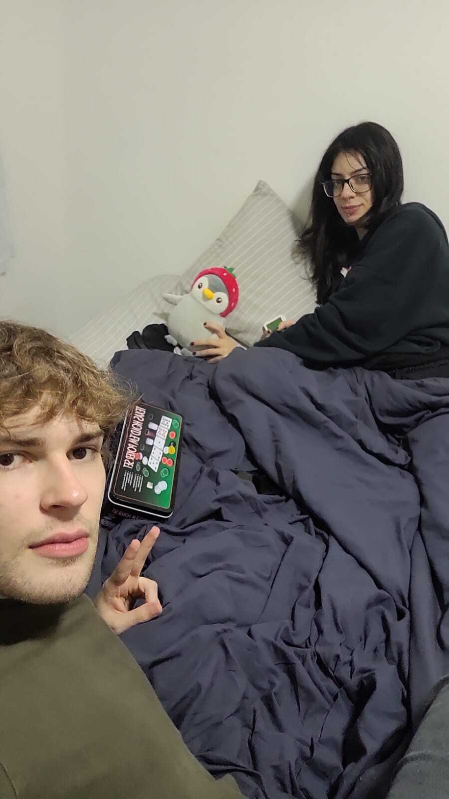
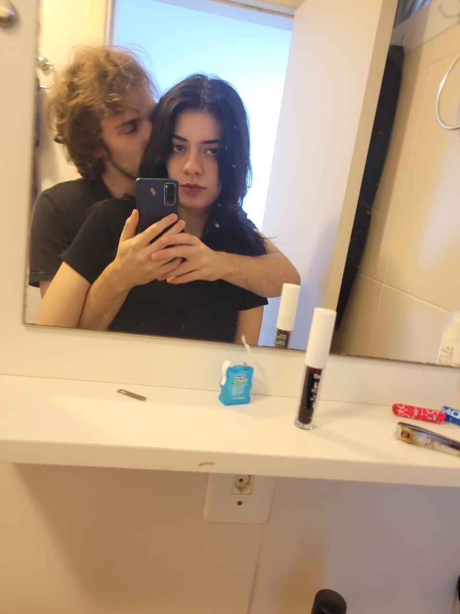
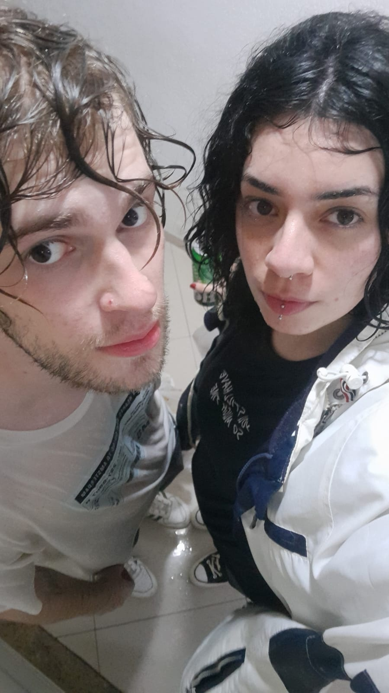
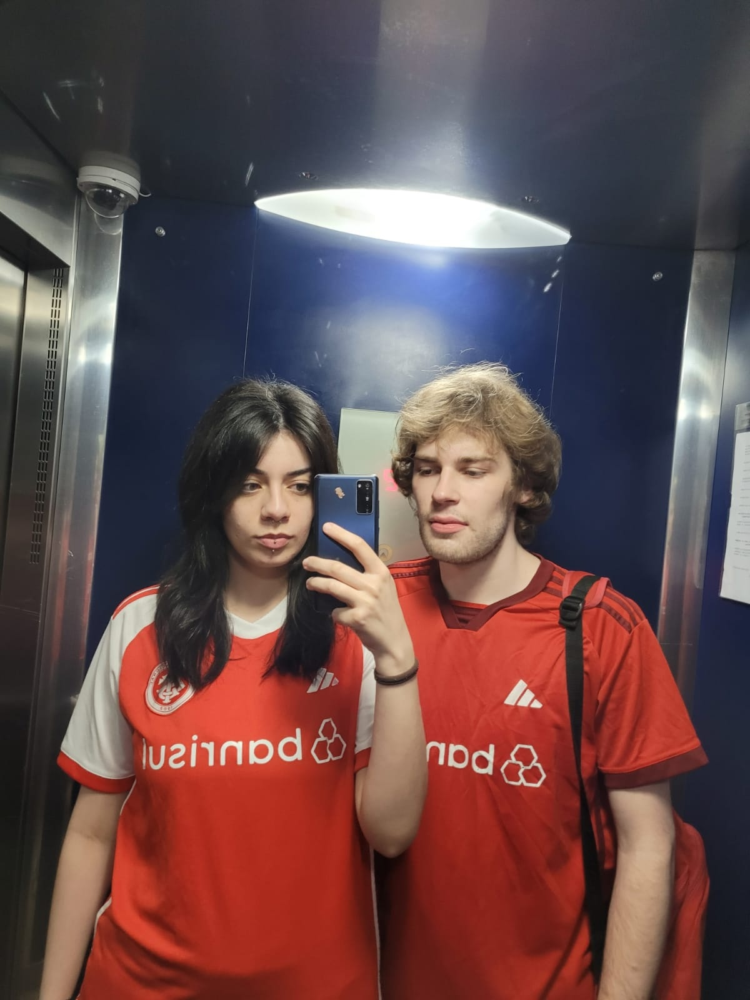
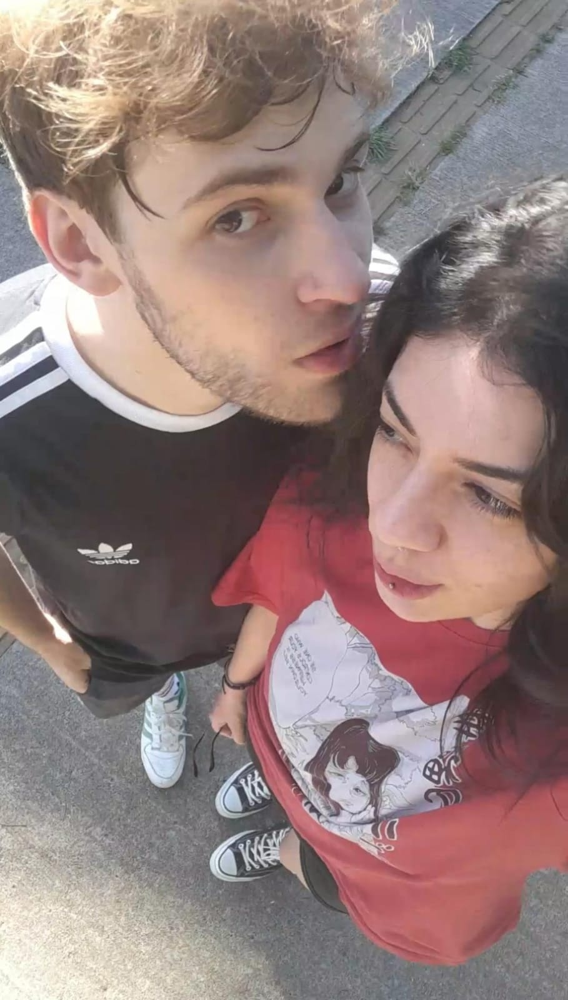
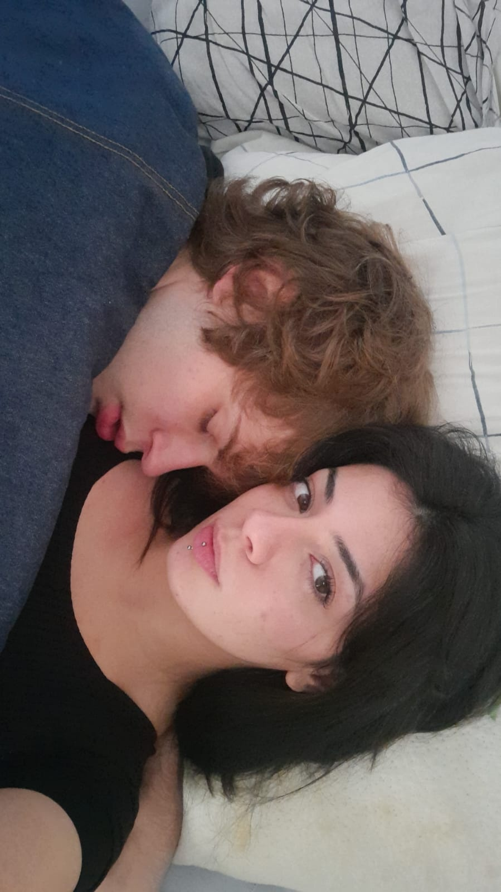
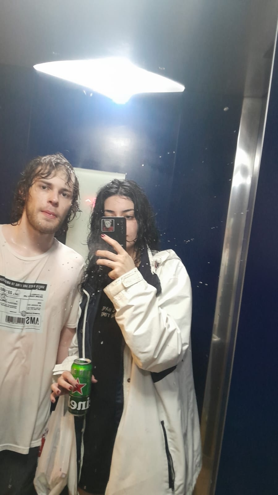

# 💖 Happy6Months 💖

Welcome to the *cutest* repo on GitHub. I made this to the *cutest* girl ever(Igarinha Gatinha bb). This is my way of showing you that I love you, it required quite some effort and I hope you like it  
This repo was created to celebrate our 6 months together, I doubt anyone would make something this cute to you (right?). 🌙✨

## 💻 How to Use This Lovely Script

You can decorate our photos with adorable hearts 💖 or tiny pinguimzinhos 🐧 – just like digital stickers!

### ▶️ To Start

Run the script:

```bash
python3 i_love_you.py
```

### 🎮 Controls

- Press `1` → Choose **💖 hearts** mode  
- Press `2` → Choose **🐧 pinguimzinhos** mode  
- 🖱️ Click on the image → Add the selected sticker (heart or pinguimzinho)  
- Press `s` → **Save** the image with all the decorations 💾  


## 🥰 Why This Repo Exists

Well at first it is just a nerdy way to show you that I love you but now that I think about it is a cute way of saving our pics as some sort of diary. I hope you add to it.

a little Markdown tutorial:

use # and blank < > for writing a title ## < > for a subtitle and so on.
to add images use *<>*
ALWAYS ADD THESE STUFF TO THE FILE README.md

## 🖼️ Our Love Story in Pictures

Each image is named `img{number}.jpg` – they are referenced so that you can quickly access them

## 💬 Little Notes (Click to jump to the memory!)

- [Hmmmm sunshine made me blone (I am blonde btw 182cm 6ft) ☁🌞](#img1)  
- [Pinguimzinho wants to play poker with us 🐧♠️♥️♣️♦️](#img2)  
- [Edit of us I am fr insanely amazing. (so are you                   sometimes... hihi)](#img3)  
- [Mwahh beijinho](#img4)  
- [⛈️⛈️⛈️⛈️⛈️⛈️One of our best days together I love the rain ⛈️⛈️⛈️⛈️⛈️⛈️](#img5)  
- [❤️❤️❤️VAMOS INTER❤️❤️❤️](#img6)  
- [zzzzzz 💤💤💤](#img8)  
- [Kisses 💋](#img9)  
- [Another one in the sun ppls help](#img10)  
- [zzzzz part II](#img11)  
- [I look ugly gross beird u cute hihi love you](#img12)  
- [⛈️⛈️⛈️⛈️⛈️⛈️honestly cant really describe how amazing this day was⛈️⛈️⛈️⛈️⛈️⛈️](#img13)  
- [You llok insane I look weird](#img14)  


---

## 📸 There you go... some of our pic  
*(Pinguinzinho said he took some of those himself. Pretty sure he's lying 🐧💬)*

### <a name="img1">📷 img1.jpg</a>


### <a name="img2">📷 img2.jpg</a>


### <a name="img3">📷 img3.jpg</a>


### <a name="img4">📷 img4.jpg</a>


### <a name="img5">📷 img5.jpg</a>


### <a name="img6">📷 img6.jpg</a>


### <a name="img7">📷 img7.jpg</a>


### <a name="img8">📷 img8.jpg</a>


### <a name="img9">📷 img9.jpg</a>


### <a name="img10">📷 img10.jpg</a>


### <a name="img11">📷 img11.jpg</a>


### <a name="img12">📷 img12.jpg</a>


### <a name="img13">📷 img13.jpg</a>


## 🧡 Just So You Know

I honestly hope you cherish this repository, this is very nerdy (as I know you like) also this might be somewhat useful to you so you learn a little bit how to code, use git and run scripts in python 🐍

---

With all my love,  
**cae 💻💕**
