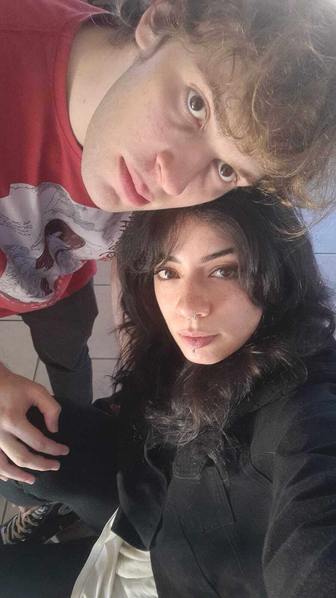

# 💖 Happy6Months 💖

Welcome to the *cutest* repo on GitHub. I made this to the *cutest* girl ever(Igarinha Gatinha bb). This is my way of showing you that I love you, it required quite some effort and I hope you like it  
This repo was created to celebrate our 6 months together, I doubt anyone would make something this cute to you (right?). 🌙✨

## 🥰 Why This Repo Exists

Well at first it is just a nerdy way to show you that I love you but now that I think about it is a cute way of saving our pics as some sort of diary. I hope you add to it.

a little Markdown tutorial:

use # and blank < > for writing a title ## < > for a subtitle and so on.
to add images use *<>*
ALWAYS ADD THESE STUFF TO THE FILE README.md

## 🖼️ Our Love Story in Pictures

Each image is named `img{number}.jpg` – they are referenced so that you can quickly access them

## 💬 Little Notes

- `data/img1.jpg` — Remember this day? You looked like a dream. ☁️  
- `data/img2.jpg` — I still laugh every time I see this. You’re my sunshine. 🌻  
- `data/img3.jpg` — The best hug ever. No contest. 🫂  
*(More memories coming soon...)*

## There you go... some of our pic (pinguinzinho said he took some of those himself pretty sure he's lying)

## 🧡 Just So You Know

I honestly hope you cherish this repository, this is very nerdy (as I know you like) also this might be somewhat useful to you so you learn a little bit how to code, use git and run scripts in python 🐍

---

With all my love,  
**cae 💻💕**
